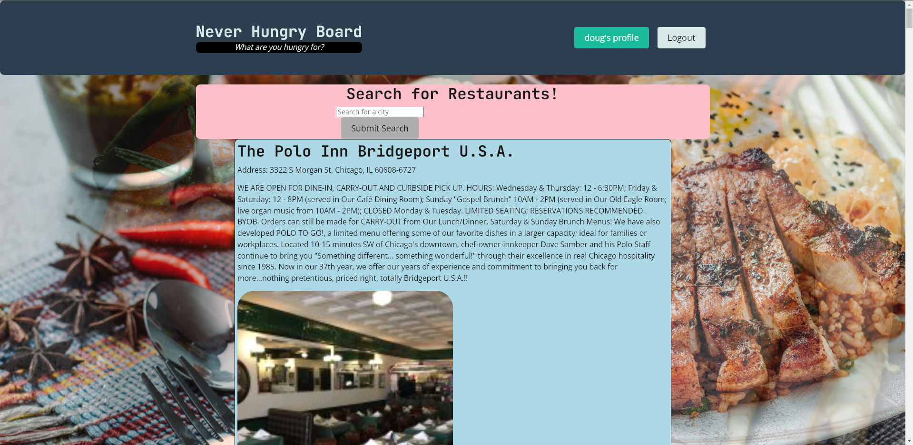

## Project Title:

Never Hungry Board

https://choosealicense.com/licenses/mit/

## Table of Contents:

- [Installation](#installation)
- [Usage](#usage)
- [License](#license)
- [Contributors](#contributors)
- [Tests](#tests)
- [Links](#links)

## Installation:

1. Clone repository to local drive
2. 'npm i' in terminal to install necessary node packages
3. 'npm run develop' to open server and login to perform search

## Usage:

This application currently finds restaurants in a desired search location that the user inputs. The user is then able to save any points of interest to their profile.

## Contributors:

- Reniel Christianson
- Connor Semb
- Doug McGillivray

## Tests:

Tests are currently not being run on this application.

## Links:

- Github Repository: https://github.com/PolishMustard624853/Never-Bored-Board
- Heroku Deployment: https://never-bored-board.herokuapp.com/

## Screenshot:

